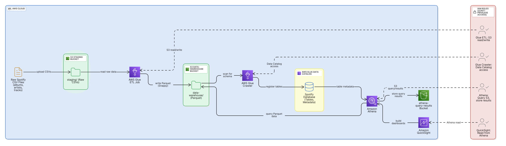
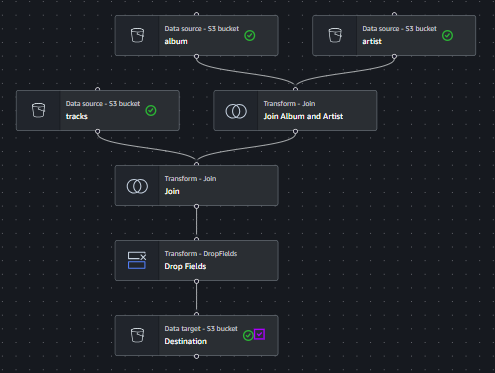
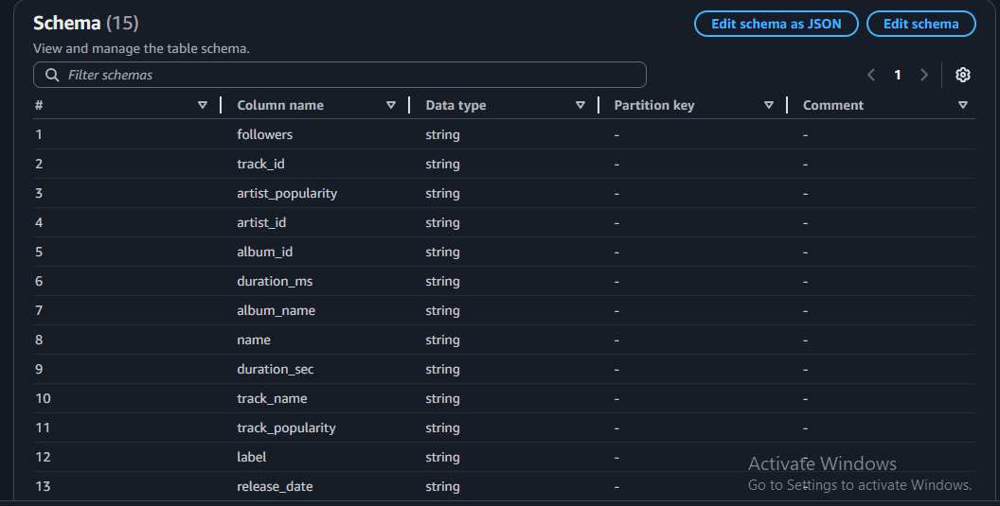
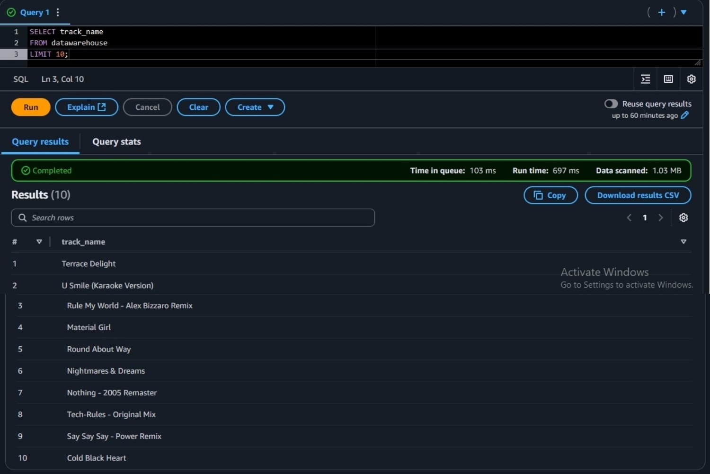
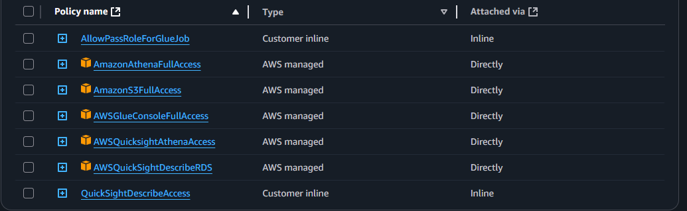

# AWS Data Engineering Pipeline


This project demonstrates an end-to-end data engineering pipeline on AWS. It shows how to build a scalable, cloud-based data lake architecture to ingest, transform, catalog, query, and visualize data in a cost-effective and efficient way.

## 🚀 Features

- **Amazon S3**: Stores raw and transformed data in separate logical folders (staging and data warehouse)
- **AWS Glue**: Serverless ETL jobs to transform CSV data to optimized Parquet format
- **AWS Glue Crawler**: Catalogs data for Athena by creating schema metadata
- **Amazon Athena**: Enables serverless, SQL-based analytics directly on data stored in S3
- **Amazon QuickSight**: Visualizes the final data with interactive dashboards
- **IAM Roles**: Follows least-privilege access patterns to securely connect services

## 📂 Dataset

The raw CSV dataset used for this pipeline consists of three files:

- `albums.csv`
- `artists.csv`
- `tracks.csv`

Because of size limits on GitHub, the full-size datasets are **not** stored directly in this repository. Instead, you can [download the sample data from Google Drive here](https://drive.google.com/drive/folders/1BhMrGZ2cMVzftD_KlctNqn0VGzmqjPv6?usp=sharing) and place them in the `datasets/` folder before running the ETL pipeline.

> **Note**  
> The repository includes only sample-size data files under 25MB for demonstration. For full-scale processing, use the shared drive link above.

## ✅ Prerequisites

- An active AWS account with S3, Glue, Athena, and QuickSight enabled
- AWS CLI configured (optional but recommended)
- IAM permissions to create buckets, Glue jobs, crawlers, and run Athena queries

## 🚀 Getting Started

1. Clone this repository  
   ```bash
   git clone https://github.com/Durvesh123/Aws-Data-Engineering-Pipeline.git
   ```
2. Upload the sample datasets to your S3 bucket's staging folder

3. Create your Glue job with the provided PySpark script from scripts/

4. Configure the Glue crawler to register your Data Catalog

5. Run queries in Athena with the sample queries in queries/

6. (Optional) Connect QuickSight to Athena to build dashboards
   
## 🛠️ How It Works


1. **Upload raw CSV data** (albums, artists, tracks) to the `staging` folder in your S3 bucket  
2. **AWS Glue ETL job**:
   - Joins data across CSVs
   - Cleans and transforms columns
   - Converts to Parquet with Snappy compression
   - Writes output to the `datawarehouse` folder in S3  
     
   .PNG)
3. **AWS Glue Crawler**:
   - Crawls the `datawarehouse` folder
   - Registers the schema in Glue Data Catalog (as `spotify_db`)  
   
4. **Amazon Athena**:
   - Uses the Data Catalog to query data with serverless SQL
   - Saves query results to a separate S3 bucket (`athena-query-results`)  
   
5. **Amazon QuickSight**:
   - Connects to Athena to build interactive dashboards
6. **IAM Roles**:
   - Provide least-privilege permissions between Glue, Athena, S3, and QuickSight  
   


## 🔍 Sample Athena Queries

You can find sample SQL queries in [`queries/sample_queries.sql`](queries/sample_queries.sql). For example:

```sql
SELECT track_name, track_popularity
FROM spotify_db.datawarehouse
ORDER BY track_popularity DESC
LIMIT 5;
```
## 📄 License

This project is licensed under the [MIT License](LICENSE).

